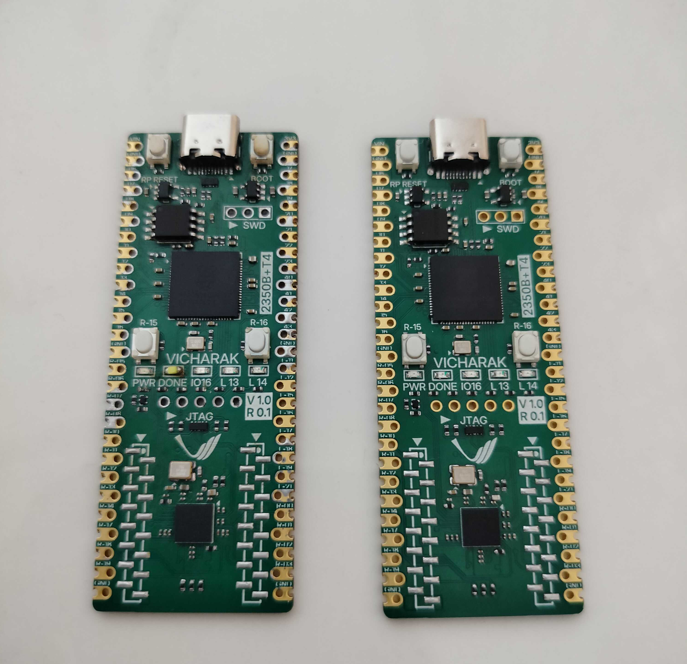

# zen 

Zen is a family of Feature Full FPGA development board along with a host microcontroller. Zen is successor to Vicharak's [Shrike](https://github.com/vicharak-in/shrike) Family of Dev Boards. 

 Family Members -:

    Zen R4 (Trion4k + RP2350B)
    Zen R8 (Trion8k + RP2350B)

Both the board are pin to pin compatible so much so that they have the same PCB board only the FPGA is different.

 

### Key Features : 

| **Feature**                         | **ZEN R4**              | **ZEN R8**             |
|:-----------------------------------:|:-----------------------:|:----------------------:|
| FPGA                                | Efinix Trion T4         | Efinix Trion T8        | 
| MCU                                 | RP2350B                 | RP2350B                | 
| Breadboard Compatible               | ✅                      | ✅                     |
| FPGA ↔ MCU IO Interface             | 10 Bit Parallel Bus     |  10 Bit Parallel Bus   |  
| Flash (QSPI)                        | Upto 128 MB             | Upto 128 MB            | 
| User LEDs                           | 3                       | 3                      |
| User Button                         | 2                       | 2                      |
| JTAG                                | ✅                      | ✅                     |
| USB Type-C (Power & Programming)    | ✅                      | ✅                     |
| ZEP (Zen Expansion Port)            | ✅                      | ✅                     | 

## Documentation 

 1. [PIN-OUTS](./docs/pinouts.md)

## ZEP 

ZEP - ( ZEN Expansion Port ) is a costume extension port standard designed Vicharak for the zen family of FPGA however it will be a open standard that could be ported for your open sources or closed sources project however it has to be with the ZEP name only. 

There will a load of Hats for the ZEP to be launched . 

### Tested  ( test bed)

1.  FPGA 
2.  RP2350B
3.  LED  ( needs changes)
4.  Button 
4.  Oscillator 
5.  Jtag 
6.  SPI Programming  ( needs changes)
7.  Reset 
8.  Boot 
9.  QSPI Flash 
10. USB 

## LICENSE 

### Software

This project’s software is licensed under the Apache-2.0 license.
See the [LICENSE](./LICENSE.md)for details.

### Hardware

This project’s hardware designs (HDL/RTL, schematics, PCB files, constraints, etc.) are licensed under the CERN Open Hardware License v1.2.
See [LICENSE_HW](./LICENSE_HW.md) for details.
