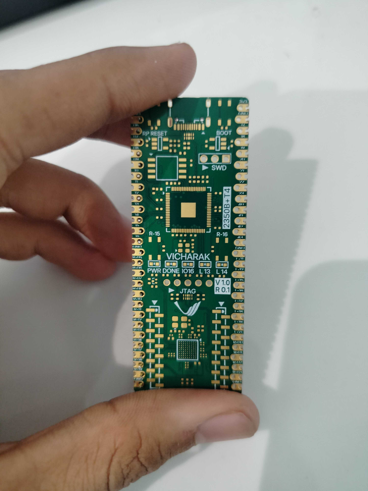

# RP2350B + Efinix Trion 4 / 8 

### V1.0 R 0.1 

### Tested 

1.  FPGA 
2.  RP2350B
3.  LED 
4.  Button 
4.  Oscillator 
5.  Jtag 
6.  SPI Programming 
7.  Reset 
8.  Boot 
9.  QSPI Flash 
10. USB 
