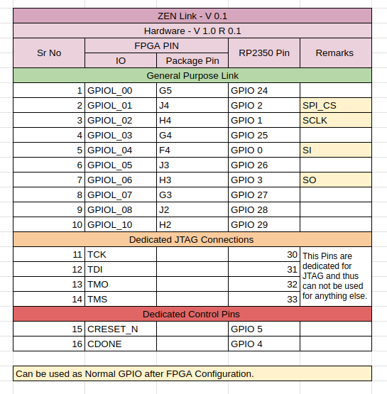

# Pin Outs

## Zen Link 

Zen Link is a multibit hardware communication link between FPGA and RP2350 on ZEN. 

These are the spec for the same. You can use the GPIO in a way you please. 

 * TODO : Add know constraints and limitaitons. 

### Zen link pinouts

